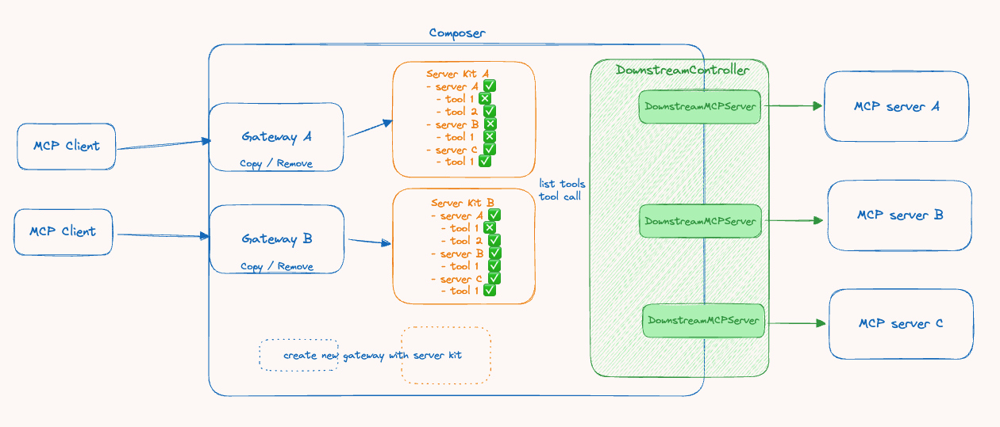

# MCP Composer


This is a gateway service for MCP servers scheduler that dynamically manages connections to multiple MCP servers and their available tools. It exposes a port as an interface for MCP clients and supports creating multiple ports to accommodate different combinations of MCP servers.

## Key Features

*   **Built on FastAPI**: A modern, high-performance web framework with automated interactive API documentation.
*   **MCP Integration**: Utilizes the `mcp` library to interact with Minecraft-related protocols or servers (specific functionality depends on the implementation in `src/main.py`).
*   **Pydantic Data Validation**: Strict data validation using Python type hints.
*   **Configuration-Driven**: Easily manage target servers through the `mcp_servers.json` file.
*   **Asynchronous Support**: Leverages Python's `async`/`await` syntax for high-performance asynchronous operations.
*   **MCP Gateway**: Connects, dispatches, and manages multiple backend MCP servers through a single interface.
*   **Dynamic Tool Management**: Dynamically manages tools available to clients from backend MCP servers.

## System Architecture



## Requirements

*   Python >= 3.12
*   [uv](https://github.com/astral-sh/uv): A fast Python package installer and manager.

## Installation

1.  **Clone the repository**:
    ```bash
    git clone https://github.com/htkuan/mcp-composer
    cd mcp-composer
    ```

2.  **Install dependencies**:
    Use `uv` to sync the project dependencies.
    ```bash
    make install
    # or directly use uv
    # uv sync
    ```

## Configuration

Before running the application, you need to configure the target MCP servers.

1.  Copy the example configuration file:
    ```bash
    cp mcp_servers.example.json mcp_servers.json
    ```
2.  Edit `mcp_servers.json` and enter the details of the MCP servers you want to connect to.

3.  Set up environment variables:
    ```bash
    cp .env.example .env
    ```
4.  Edit the `.env` file to configure the following settings:
    - `HOST`: Server host address (default: 0.0.0.0)
    - `PORT`: Server port (default: 8000)
    - `MCP_COMPOSER_PROXY_URL`: MCP Composer proxy URL (default: http://localhost:8000)
    - `MCP_SERVERS_CONFIG_PATH`: Path to the MCP servers configuration file (default: ./mcp_servers.json)

## Running

Use `uv` to run the FastAPI application:

```bash
make run
# or directly use uv
# uv run src/main.py
```

After the service starts, you can interact with the API through the API documentation in your browser (typically at `http://127.0.0.1:8000/docs`).

## Development

The project includes a `Makefile` to simplify common development tasks:

*   **Install dependencies**: `make install`
*   **Format and check code**: `make format` (using Ruff)
*   **Run the application**: `make run`

## Contributing

Contributions to this project are welcome! Please follow the standard GitHub Fork & Pull Request workflow. It's recommended to create an Issue for discussion before submitting a Pull Request.
